# PROCUCEV ENTERPRISE (QUA AI 2.0)
## Complete System Architecture, Workflow Guide & Operations Manual

---

### Document Overview & Metadata

| Field | Description / Value |
| :--- | :--- |
| **Platform Name** | Procucev Enterprise Solutions (QUA AI 2.0) |
| **System Version** | Production Release 2.0 (August 2026) |
| **Primary Domain** | Autonomous Enterprise Sourcing, Procurement Intelligence & Logistics Matching |
| **Core Sourcing Modes** | Mode 1 (Client Approved Roster), Mode 2 (Hybrid Sourced Pool), Mode 3 (360° Vendor Qualification) |
| **Security & Compliance** | Dual OTP Verification, Azure AD SSO, SHA-256 Cryptographic Audit Stamping, DLT / TRAI Compliant |
| **Target Roles** | Enterprise Buyer (L&T), Category Manager, Vendor Partner (Apex Supplies), Platform Admin & Auditor |
| **Word Document Export** | [`Procucev_Enterprise_Platform_Documentation.docx`](./Procucev_Enterprise_Platform_Documentation.docx) (17.3 MB) |

---

## 1. Executive Summary & Value Proposition

**Procucev Enterprise** (powered by **QUA AI 2.0**) is an autonomous procurement intelligence and supplier orchestration platform engineered for heavy engineering, EPC, industrial infrastructure, and manufacturing supply chains. 

Traditional enterprise sourcing suffers from severe operational bottlenecks:
1. **Prolonged Chasing Cycles**: Procurement teams spend up to 70% of their working hours manually calling, emailing, and messaging suppliers for quote submissions.
2. **Subjective Vendor Qualification**: Lack of standardized, verifiable audit data leads to high-risk supplier selections and project delays.
3. **Fragmented Audit Trails**: Communications across phone calls, chat apps, and emails lack centralized compliance records.

**Procucev solves these problems** by embedding autonomous AI agents that parse complex Bill of Quantities (BOQ), dispatch multi-channel outreach across Voice Calls, WhatsApp, and SMS, normalize competitive bids into parametric comparison matrices, and execute cryptographic audit seals for enterprise ERP synchronization.

### Business Impact Benchmarks
* **65% Reduction** in RFQ-to-PO turnaround time (from 14 days down to 4.8 days).
* **100% Elimination** of unmonitored supplier non-response via 24-hour automated escalation rules.
* **14.8% Average Cost Savings** unlocked through AI parametric quote benchmarking.
* **100% Tamper-Evident Governance** backed by SHA-256 cryptographic transaction seals.

---

## 2. Core Sourcing Operating Modes

Procucev offers three selectable sourcing operational modes designed for varying compliance and discovery requirements:

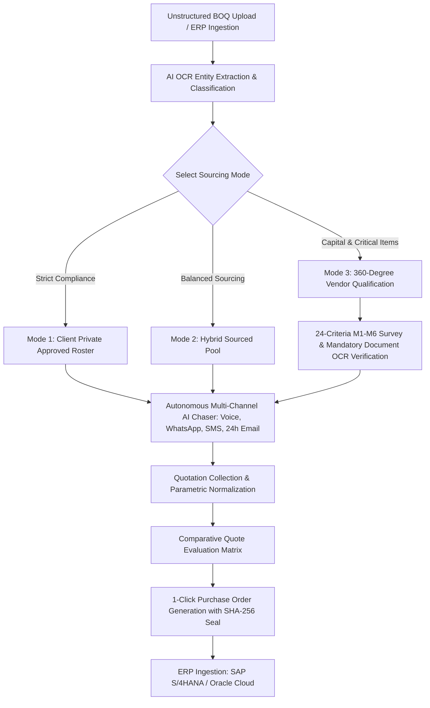
```mermaid
graph TD
    BOQ[Unstructured BOQ Upload / ERP Ingestion] --> Ingestion[AI OCR Entity Extraction & Classification]
    Ingestion --> ModeSelect{Select Sourcing Mode}
    
    ModeSelect -->|Strict Compliance| M1[Mode 1: Client Private Approved Roster]
    ModeSelect -->|Balanced Sourcing| M2[Mode 2: Hybrid Sourced Pool]
    ModeSelect -->|Capital & Critical Items| M3[Mode 3: 360-Degree Vendor Qualification]
    
    M1 --> Chaser[Autonomous Multi-Channel AI Chaser: Voice, WhatsApp, SMS, 24h Email]
    M2 --> Chaser
    M3 --> M3Survey[24-Criteria M1-M6 Survey & Mandatory Document OCR Verification]
    M3Survey --> Chaser
    
    Chaser --> Quotes[Quotation Collection & Parametric Normalization]
    Quotes --> Matrix[Comparative Quote Evaluation Matrix]
    Matrix --> PO[1-Click Purchase Order Generation with SHA-256 Seal]
    PO --> ERP[ERP Ingestion: SAP S/4HANA / Oracle Cloud]
```

### Sourcing Modes Comparison Table

| Feature / Dimension | Mode 1: Client Approved Roster | Mode 2: Hybrid Sourced Pool | Mode 3: 360° Qualification |
| :--- | :--- | :--- | :--- |
| **Target Use Case** | Proprietary designs, single-source items, internal frame agreements | Standard competitive items, electricals, valves, structural steel | Heavy machinery, high-pressure piping, critical EPC equipment |
| **Vendor Scope** | Pre-approved internal client roster exclusively | Client roster + AI-recommended discovery suppliers | Full 6-pillar pre-qualified supplier network |
| **Qualification Level** | Basic roster compliance | AI Quality/Match Score benchmarking | 24-criteria audit across M1-M6 with OCR verified attachments |
| **Multi-Channel Chasing** | Enabled (Voice, WA, SMS, 24h Email) | Enabled (Voice, WA, SMS, 24h Email) | Enabled (Voice, WA, SMS, 24h Email) |
| **Pricing Optimization** | Pre-negotiated rate contracts | Real-time market price discovery | Comprehensive Total Cost of Ownership (TCO) |

---

## 3. Platform Architecture & Technology Stack

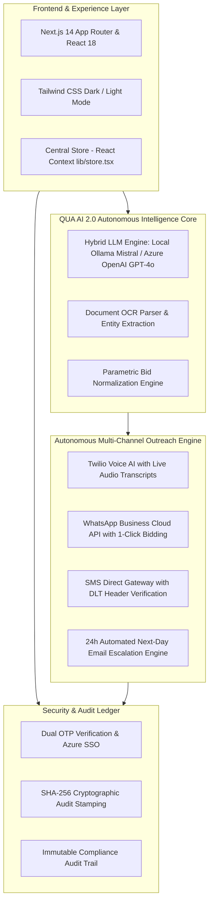
```mermaid
graph TB
    subgraph UI_Layer [Frontend & Experience Layer]
        NextApp[Next.js 14 App Router & React 18]
        Theme[Tailwind CSS Dark / Light Mode]
        State[Central Store - React Context lib/store.tsx]
    end
    
    subgraph AI_Core [QUA AI 2.0 Autonomous Intelligence Core]
        LLM[Hybrid LLM Engine: Local Ollama Mistral / Azure OpenAI GPT-4o]
        OCR[Document OCR Parser & Entity Extraction]
        Parametric[Parametric Bid Normalization Engine]
    end
    
    subgraph MultiChannel [Autonomous Multi-Channel Outreach Engine]
        Voice[Twilio Voice AI with Live Audio Transcripts]
        WA[WhatsApp Business Cloud API with 1-Click Bidding]
        SMS[SMS Direct Gateway with DLT Header Verification]
        Email[24h Automated Next-Day Email Escalation Engine]
    end
    
    subgraph Security_Ledger [Security & Audit Ledger]
        Auth[Dual OTP Verification & Azure SSO]
        Hash[SHA-256 Cryptographic Audit Stamping]
        AuditLog[Immutable Compliance Audit Trail]
    end

    UI_Layer --> AI_Core
    AI_Core --> MultiChannel
    UI_Layer --> Security_Ledger
    MultiChannel --> Security_Ledger
```

* **Frontend**: Next.js 14 App Router, React 18, Tailwind CSS, Lucide Icons, Glassmorphism UI tokens.
* **State Management**: Central reactive context store (`lib/store.tsx`) maintaining RFQs, live telemetry feeds, vendor evaluations, and audit logs.
* **AI Inference Core**: Dynamic backend switching between local Ollama (Mistral / Llama 3) for on-prem privacy and Azure OpenAI (GPT-4o) for high-complexity entity extraction.
* **Autonomous Outreach**: Integrated Twilio Voice bot with real-time speech intent recognition, WhatsApp interactive templates, carrier-grade DLT SMS, and automated SMTP escalation.
* **Cryptographic Integrity**: SHA-256 hashing for all generated Purchase Orders and immutable audit log streams.

---

## 4. Authentication, Registration & RBAC Governance

Access to Procucev Enterprise is protected by dual-channel OTP authentication and enterprise Single Sign-On (Azure AD).

### 4.1 Sign-In Portal with Role Quick-Selectors
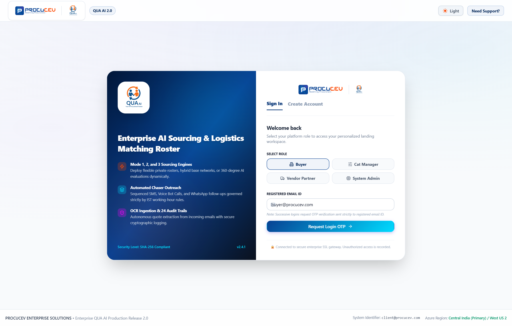
*Figure 4.1: Sign In Authentication Portal with Dual OTP and Role Switchers.*

* **Key Features**: Direct role switching for Buyer (`client@procucev.com`), Category Manager (`catmanager@procucev.com`), Vendor (`vendor@apexsupplies.com`), and Platform Auditor (`auditor@procucev.com`).
* **Security**: Enforces 4-digit MFA verification code and enterprise Azure SSO.

### 4.2 Dual-Channel Registration Portal

*Figure 4.2: Enterprise Registration Portal with Dual Email & Mobile Verification.*

* **Key Features**: Validates company tax ID / GSTIN, business email domain, and dispatches concurrent email and SMS verification codes.

### 4.3 Role-Based Access Control (RBAC) Permissions Matrix

| Permission / Functionality | Buyer (L&T) | Category Manager | Vendor (Apex) | Admin & Auditor |
| :--- | :---: | :---: | :---: | :---: |
| **Upload BOQ & Ingest RFQs** | ✅ Full | ✅ View / Audit | ❌ No Access | ❌ No Access |
| **Configure Sourcing Modes (1/2/3)** | ✅ Full | ✅ Full | ❌ No Access | ❌ No Access |
| **Trigger Multi-Channel Chasers** | ✅ Full | ✅ Batch Override | ❌ No Access | ❌ No Access |
| **View Quote Comparison Matrix** | ✅ Full | ✅ Full | ❌ No Access | ❌ No Access |
| **Generate & Sign Purchase Orders** | ✅ Full | ❌ Sign-off Only | ❌ No Access | ❌ No Access |
| **Submit Quotations & Bids** | ❌ No Access | ❌ No Access | ✅ Full | ❌ No Access |
| **Complete Mode 3 24-Criteria Survey** | ❌ No Access | ✅ Audit & Override | ✅ Full | ❌ No Access |
| **Configure AI Models & Infrastructure** | ❌ No Access | ❌ No Access | ❌ No Access | ✅ Full |
| **View Cryptographic Audit Trail** | ❌ Read Only | ❌ Read Only | ❌ Read Only | ✅ Full / Export |

---

## 5. Enterprise Buyer Ecosystem (Module 1)

### 5.1 Screen 1.1: Buyer Command Center
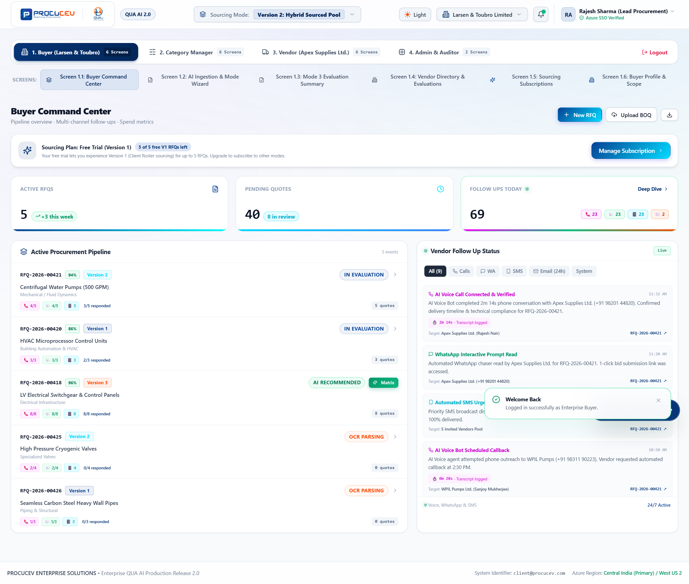
*Figure 5.1: Screen 1.1 Buyer Command Center Dashboard.*

* **Active Pipeline Cards**: Displays active requisitions tagged with Sourcing Mode badges (Mode 1, Mode 2, Mode 3), quotation counts, and OCR status.
* **Top Metric Strips**: Real-time counters for Active RFQs (5), Pending Quotes (40), and Multi-Channel Follow-ups (69 today).
* **Live Telemetry Feed**: Right-side activity stream displaying real-time updates from AI Voice Calls, WhatsApp read receipts, and SMS delivery receipts.

### 5.2 Autonomous Multi-Channel Chaser Dispatch Modal
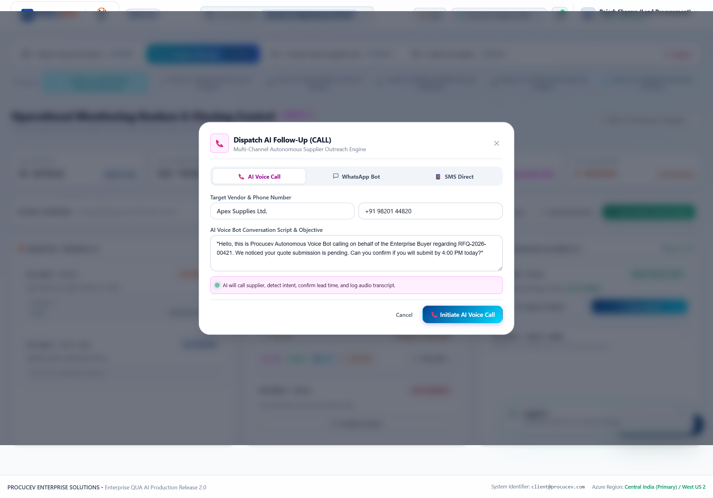
*Figure 5.2: Multi-Channel Autonomous Chaser Outreach Modal.*

* **AI Voice Call Tab**: Autonomous voice bot calling supplier desks, confirming quote submission timelines, and capturing audio transcripts.
* **WhatsApp Bot Tab**: Interactive message dispatch with instant 1-click bid submission link.
* **SMS Direct Alert Tab**: Carrier-priority DLT SMS alerts for urgent deadline notifications.

### 5.3 RFQ Follow-Up Telemetry & 4-Channel Deep-Dive Matrix
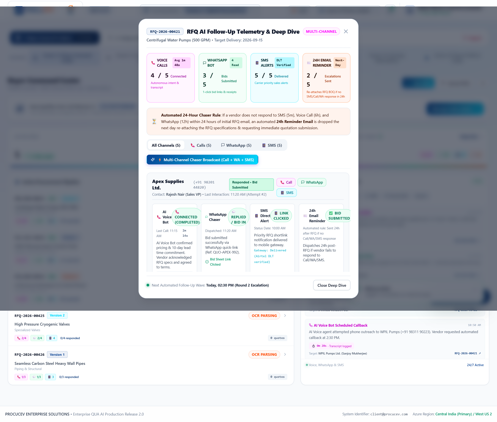
*Figure 5.3: RFQ Follow-Up Telemetry & 4-Channel Deep-Dive Matrix Modal.*

* **Supplier Telemetry**: Granular tracking per vendor across Voice Call duration, WhatsApp message preview, SMS delivery status, and 24-hour reminder email triggers.
* **Automated 24-Hour Rule**: If a vendor fails to respond to Call/WA/SMS within 24 hours, the system automatically drops an escalation email with re-attached BOQ specs.

### 5.4 Screen 1.2: AI Ingestion & Sourcing Mode Dispatch Wizard
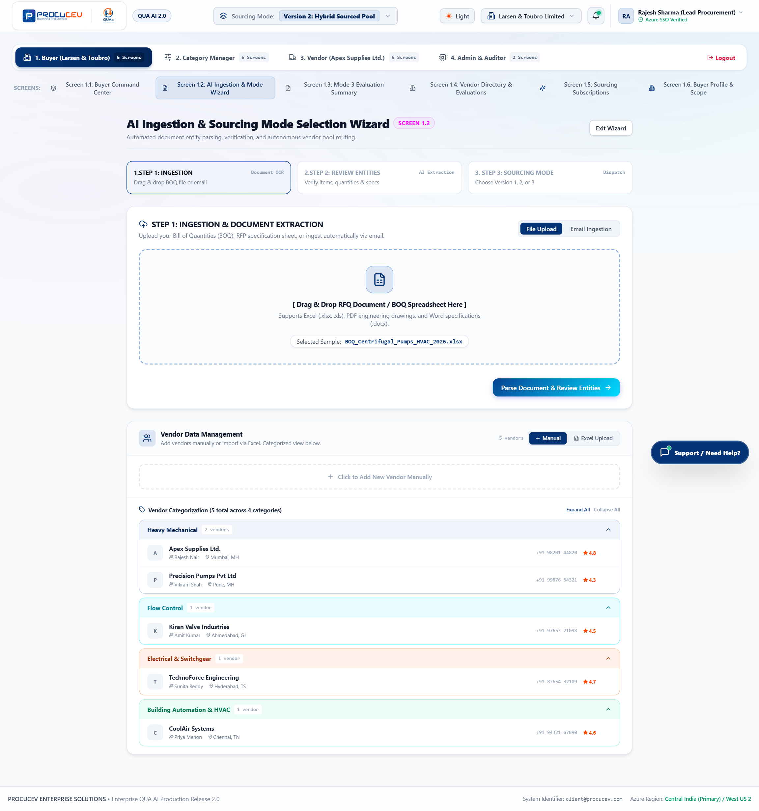
*Figure 5.4: Screen 1.2 AI Ingestion & Sourcing Mode Wizard.*

* **Drag-and-Drop Ingestion**: Supports PDF, Excel, CSV, and CAD bill of materials.
* **OCR Entity Extraction**: 98.4% confidence extraction of item names, quantities, unit specs, and estimated price ranges.
* **Sourcing Mode Selector**: 1-click dispatch to Mode 1 (Private Roster), Mode 2 (Hybrid Network), or Mode 3 (360° Qualification).

### 5.5 Comparative Quote Evaluation Matrix (Screen 1.3)
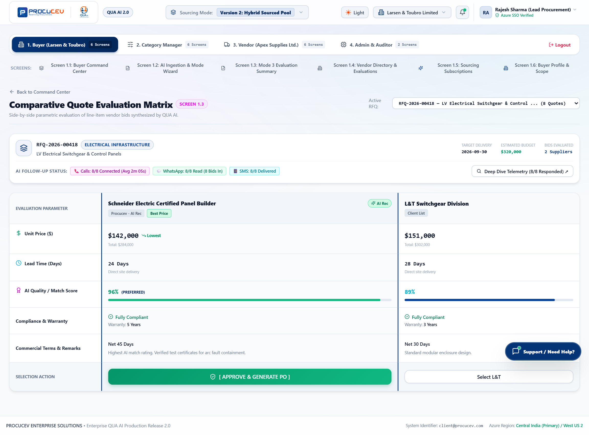
*Figure 5.5: Comparative Quote Evaluation Matrix.*

* **Side-by-Side Parametric Evaluation**: Directly compares unit prices (identifying lowest price), lead times, AI Quality/Match scores (96% vs 89%), warranty terms, and commercial conditions.
* **1-Click PO Trigger**: `[ APPROVE & GENERATE PO ]` action button triggers instant contract creation.

### 5.6 Enterprise Purchase Order Generation Modal
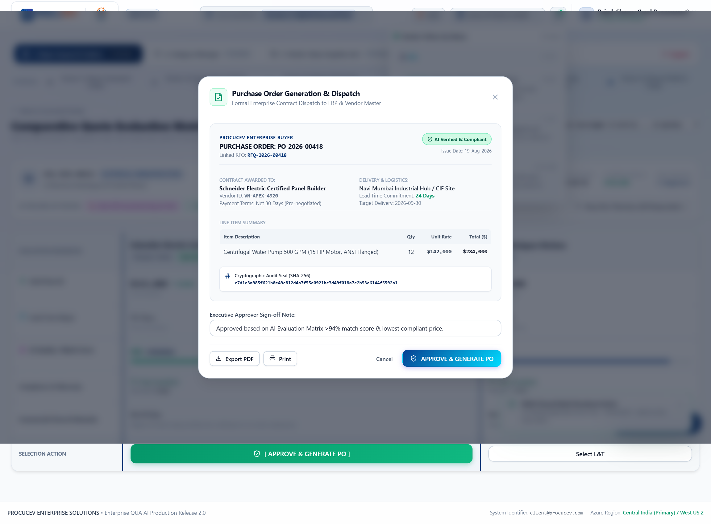
*Figure 5.6: Purchase Order Generation & Cryptographic Dispatch Modal.*

* **Formal PO Layout**: Displays PO number (`PO-2026-00418`), linked RFQ, awarded vendor, itemized financials ($284,000), and logistics destination.
* **Cryptographic Audit Seal**: Stamped with a SHA-256 digital hash (`c7d1e3a985f6...`) verifying document authenticity.

### 5.7 Screen 1.3: Mode 3 360-Degree Vendor Evaluation Summary
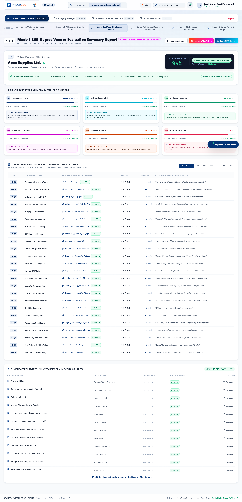
*Figure 5.7: Screen 1.3 Mode 3 360-Degree Vendor Evaluation Summary Report.*

* **6-Pillar Subtotals**: Evaluates M1 Commercial (23.75/25), M2 Technical (14.25/15), M3 Quality & Warranty (20/20), M4 Operational Delivery (18/20), M5 Financial Stability (10/10), and M6 Governance & ESG (9/10).
* **24-Criteria Matrix**: Displays individual criterion scores, weighted percentages, mandatory document attachment verification (24/24 verified), and AI auditor justifications.

### 5.8 Screen 1.4: Vendor Directory & Master Records
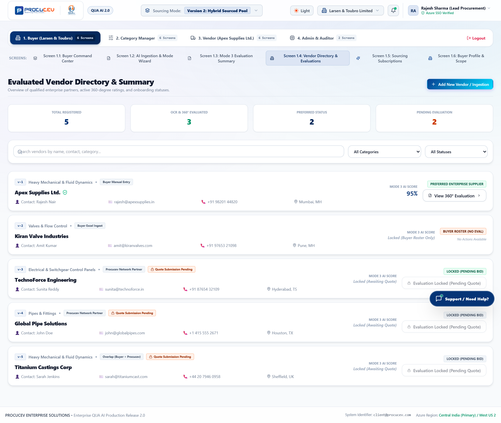
*Figure 5.8: Screen 1.4 Vendor Directory & Evaluation Master Records.*

* **Vendor Cards**: Searchable supplier profiles showing category tags, historical ratings, verified badges, and quick RFQ dispatch actions.

### 5.9 Screen 1.5: Buyer Sourcing Subscriptions & Quota Plans
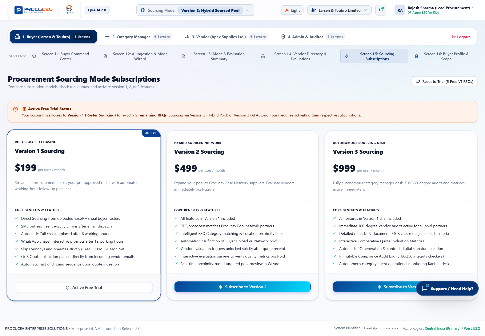
*Figure 5.9: Screen 1.5 Buyer Sourcing Subscriptions & Quota Center.*

* **Usage Meters**: Tracks remaining free RFQs (Mode 1 Free Trial) and offers self-service upgrades to Mode 2 Hybrid and Mode 3 Enterprise Unlimited.

### 5.10 Screen 1.6: Buyer Profile & Procurement Scope
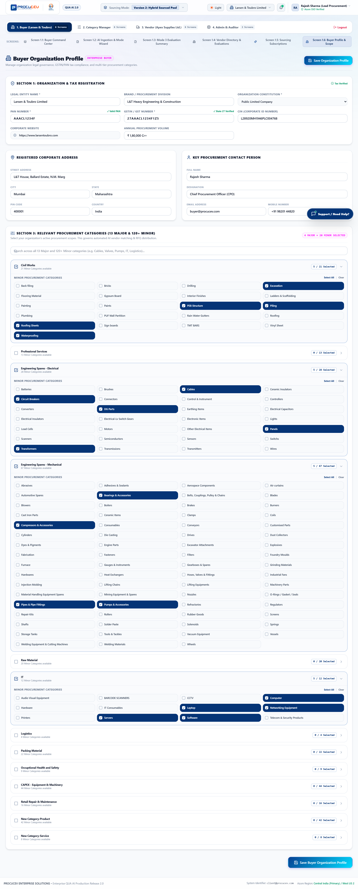
*Figure 5.10: Screen 1.6 Buyer Profile & Scope Configurations.*

* **Enterprise Governance**: Manages ERP connection endpoints, tax IDs, factory delivery hubs, and default payment terms (Net 60).

---

## 6. Category Manager Governance Ecosystem (Module 2)

### 6.1 Screen 2.1: Operational Monitoring Kanban & Chasing Control
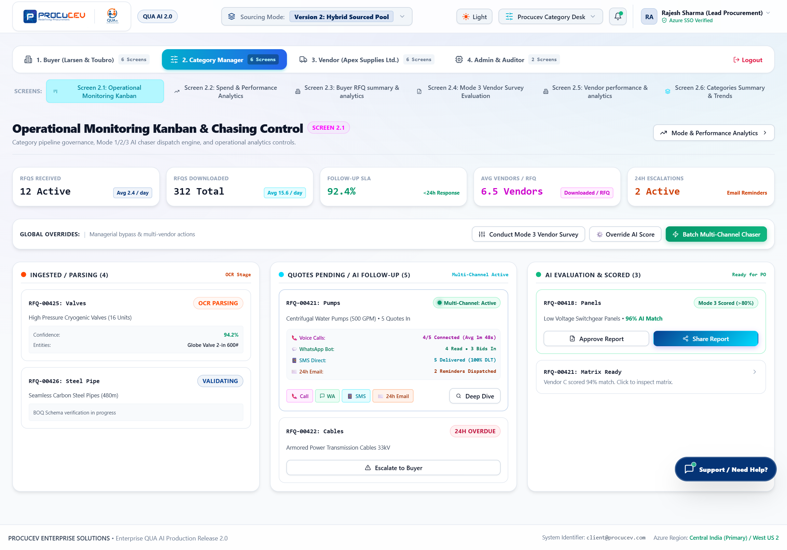
*Figure 6.1: Screen 2.1 Operational Monitoring Kanban Dashboard.*

* **3-Column Governance Pipeline**: Ingested/Parsing (4), Quotes Pending/AI Follow-Up (5), and AI Evaluation & Scored (3).
* **Managerial Actions**: Individual channel triggers (Call, WA, SMS, 24h Email), buyer escalations, and global batch chasers.

### 6.2 Screen 2.2: Spend & Performance Analytics Dashboard
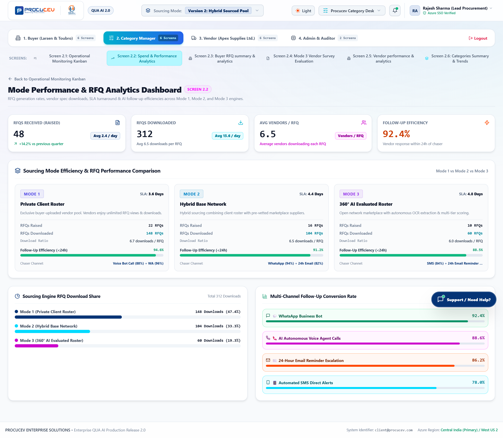
*Figure 6.2: Screen 2.2 Spend & Performance Analytics Dashboard.*

* **Key Visualizations**: Total managed spend ($1.24M), monthly spend trajectories, savings by category (14.8% average savings), and AI vs. manual procurement cycle time comparisons.

### 6.3 Screen 2.3: Buyer Console & RFQ Summary
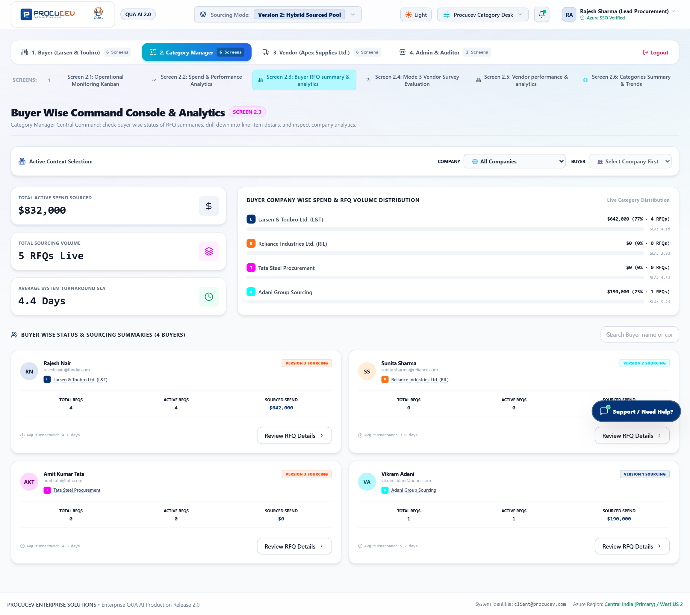
*Figure 6.3: Screen 2.3 Buyer Console & Requisition Overview.*

* **Cross-Departmental Oversight**: Aggregates procurement activities across all internal buyers with status filters and spend totals.

### 6.4 Screen 2.4: Mode 3 Vendor Survey Evaluation Audit
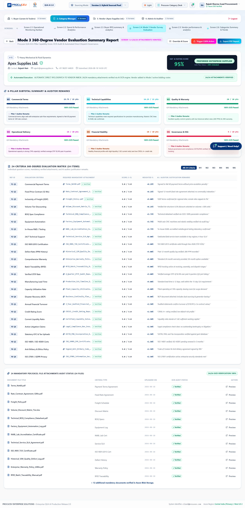
*Figure 6.4: Screen 2.4 Mode 3 Vendor Survey Audit Console.*

* **Audit Workbench**: Allows category managers to inspect uploaded vendor documents, verify OCR accuracy, and sign off on qualification score overrides.

### 6.5 Screen 2.5: Vendor Performance & Scorecard Analytics Console
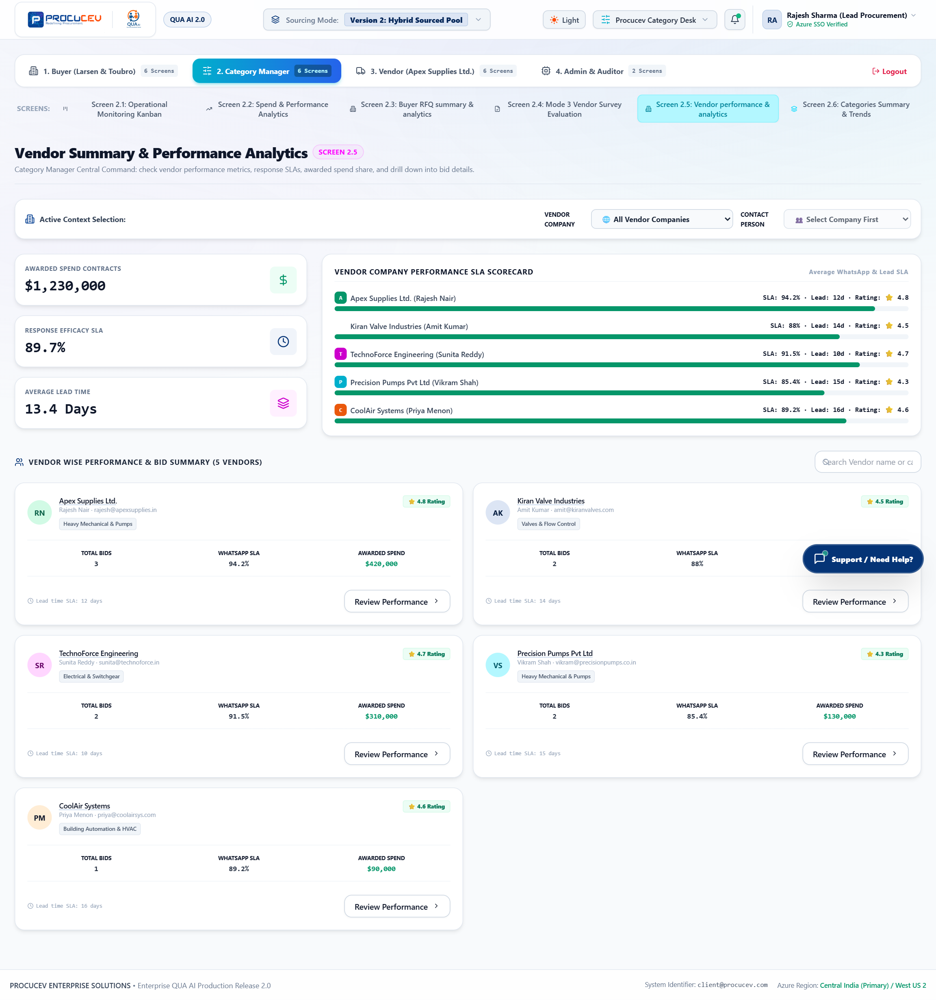
*Figure 6.5: Screen 2.5 Vendor Performance & Scorecard Console.*

* **Supplier Performance**: Detailed metrics for OTIF delivery rates, defect PPM, price competitiveness, and ESG compliance.

### 6.6 Screen 2.6: Category Taxonomy & Spend Trends
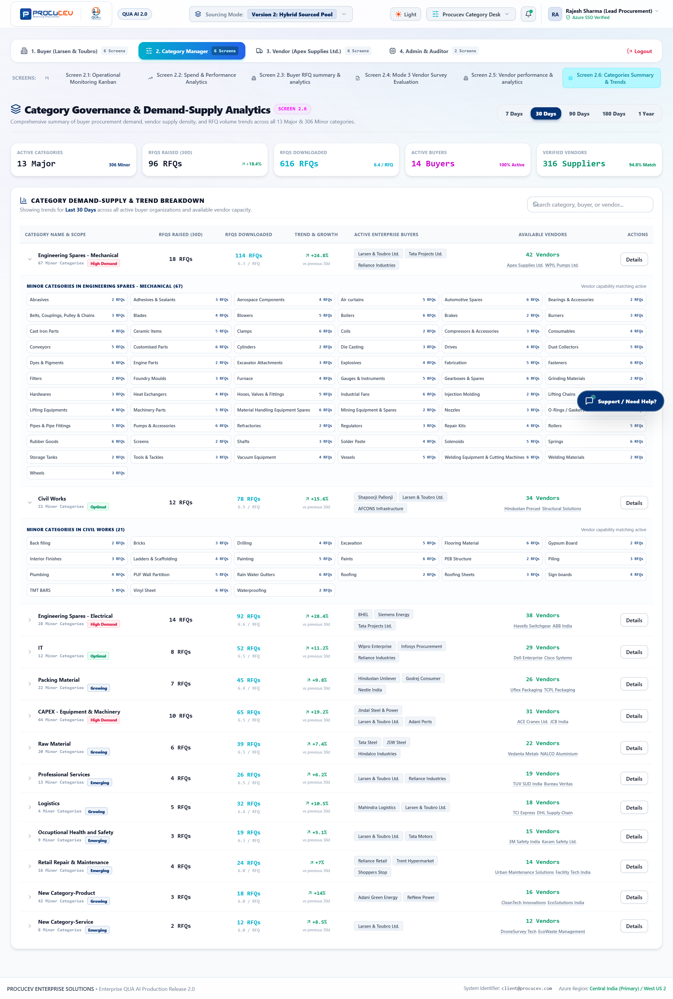
*Figure 6.6: Screen 2.6 Category Taxonomy & Spend Trends.*

* **Taxonomy Management**: Hierarchical category tree with allocated spend budgets, variance monitoring, and preferred vendor mappings.

---

## 7. Vendor Partner Ecosystem (Module 3)

### 7.1 Screen 3.1: Vendor Workspace & Opportunity Feed
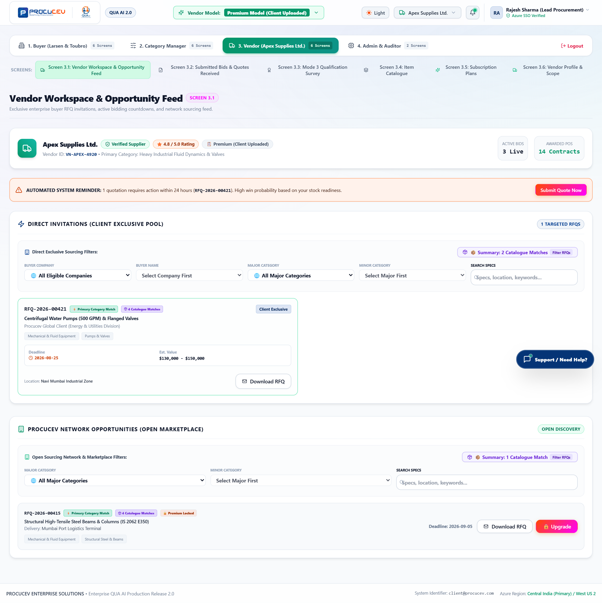
*Figure 7.1: Screen 3.1 Vendor Opportunity Feed Dashboard.*

* **Opportunity Streams**: Segregates Direct Invited RFQs (from client rosters) and Marketplace Sourcing Leads with urgent submission timers.

### 7.2 Screen 3.2: Quotation Submission & Bid Entry Form
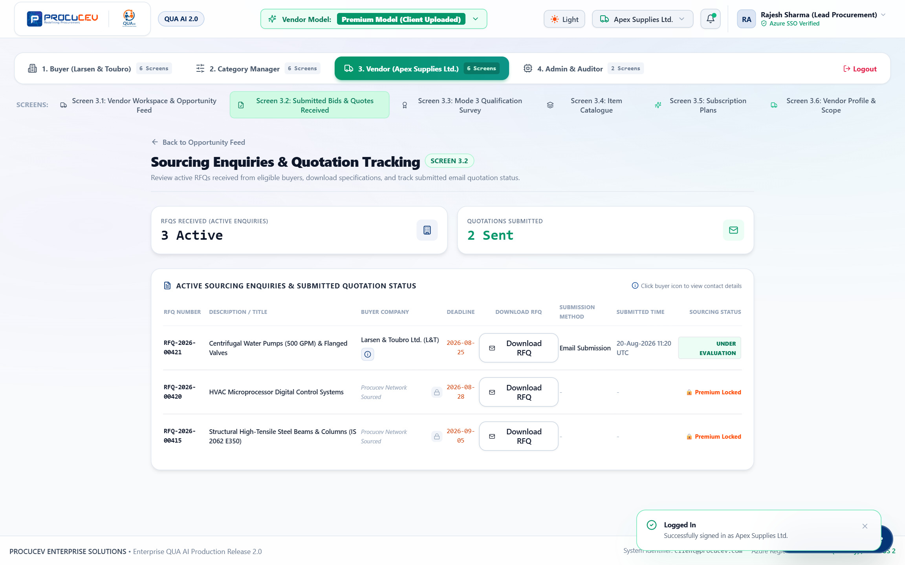
*Figure 7.2: Screen 3.2 Quotation Submission & Bid Entry Form.*

* **Itemized Bid Entry**: Real-time tax calculation, unit price inputs, lead time commitments, and technical data sheet uploads.

### 7.3 Screen 3.3: Mode 3 24-Criteria Vendor Qualification Survey
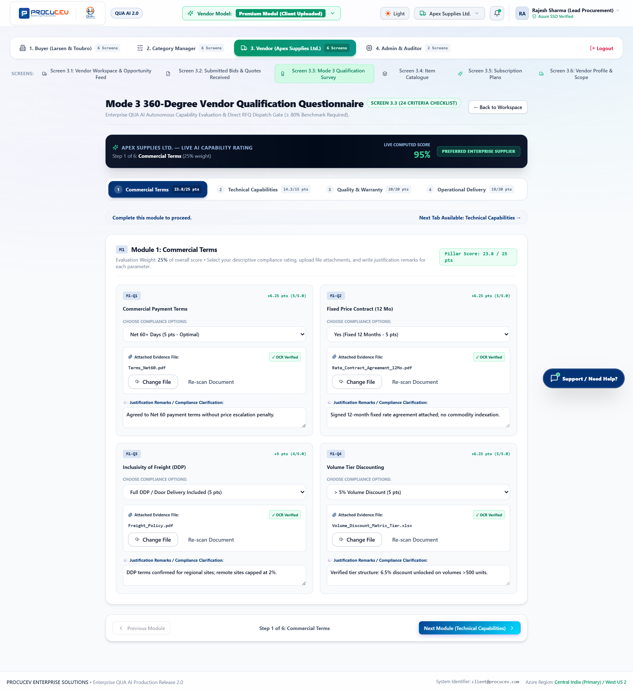
*Figure 7.3: Screen 3.3 Mode 3 24-Criteria Qualification Survey.*

* **Pillar-Based Navigation**: Suppliers complete qualification across M1-M6, attaching mandatory certificates (ISO 9001, NABL lab tests, audited financials) with immediate OCR validation feedback.

### 7.4 Screen 3.4: Item Catalogue Repository
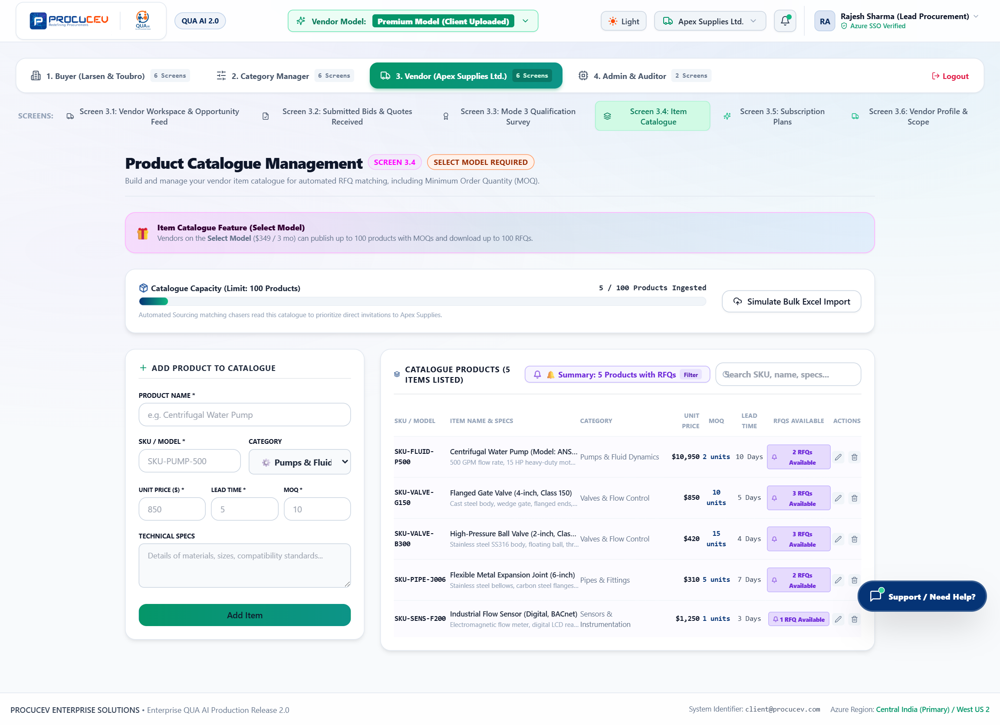
*Figure 7.4: Screen 3.4 Vendor Item Catalogue Repository.*

* **Product Repository**: Showcases supplier standard products, technical specifications, and tiered volume discount pricing.

### 7.5 Screen 3.5: Vendor Tiered Subscriptions
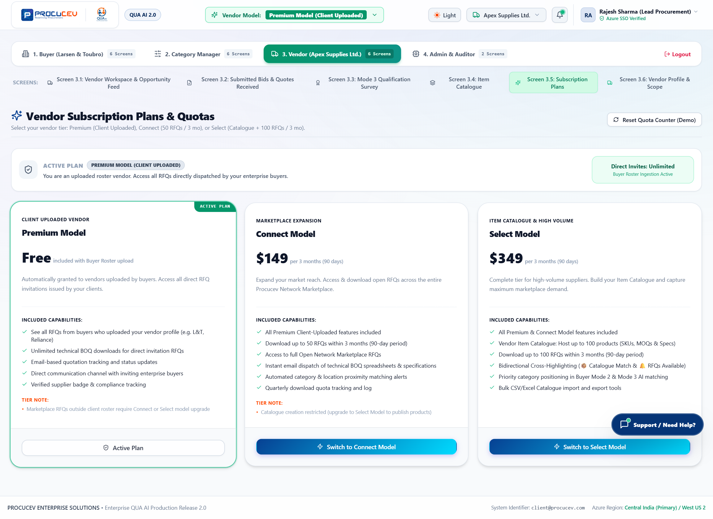
*Figure 7.5: Screen 3.5 Vendor Subscription Tier Center.*

* **Supplier Membership**: Select, Connect, and Premium subscription tiers providing expanded marketplace bid access and verified enterprise badges.

### 7.6 Screen 3.6: Vendor Profile & Manufacturing Scope
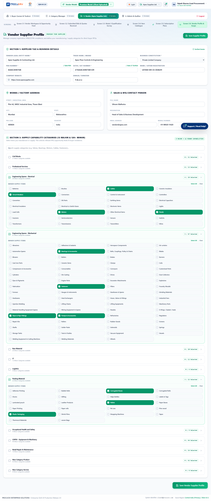
*Figure 7.6: Screen 3.6 Vendor Profile & Manufacturing Scope.*

* **Factory Capabilities**: Maintains manufacturing machine inventories, factory floor capacity, certifications, and verified contact profiles.

---

## 8. Platform Administration & Compliance Governance (Module 4)

### 8.1 Screen 4.1: Azure Infrastructure & AI Model Orchestration
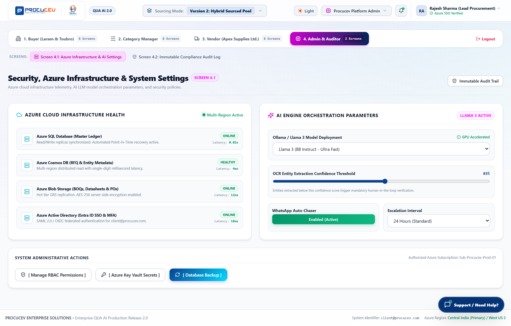
*Figure 8.1: Screen 4.1 Azure Infrastructure & AI Settings Console.*

* **AI Engine Switcher**: Dynamic runtime toggling between local Ollama (Mistral / Llama 3) and Azure OpenAI GPT-4o.
* **OCR Threshold Tuning**: Sliders for document parsing confidence thresholds (default 85%) and multi-channel API health status.

### 8.2 Screen 4.2: Immutable Compliance Audit Log & Cryptographic Verification

*Figure 8.2: Screen 4.2 Immutable Compliance Audit Log Console.*

* **Tamper-Evident Ledger**: Logs all system events with user IDs, timestamps, event descriptions, and SHA-256 cryptographic hashes with CSV/PDF export options.

---

## 9. Global Features & Autonomous Assistant Tools

### 9.1 Autonomous AI Bot Activity Feed Drawer
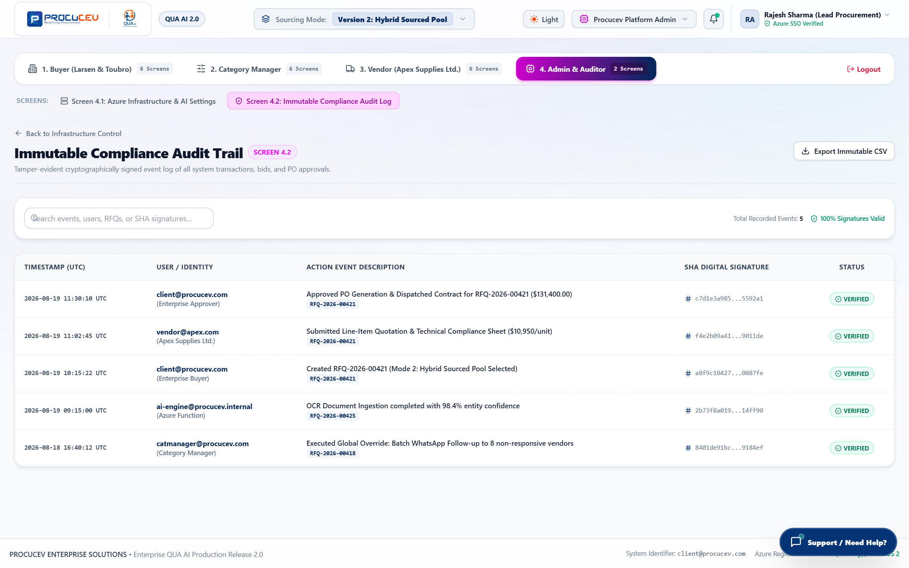
*Figure 9.1: Persistent Autonomous AI Bot Activity Feed Drawer.*

* **Live Background Stream**: Slide-out drawer displaying real-time AI autonomous activities (calls completed, WhatsApp read receipts, OCR completions, PO dispatches).

### 9.2 Interactive AI Support Chat Assistant
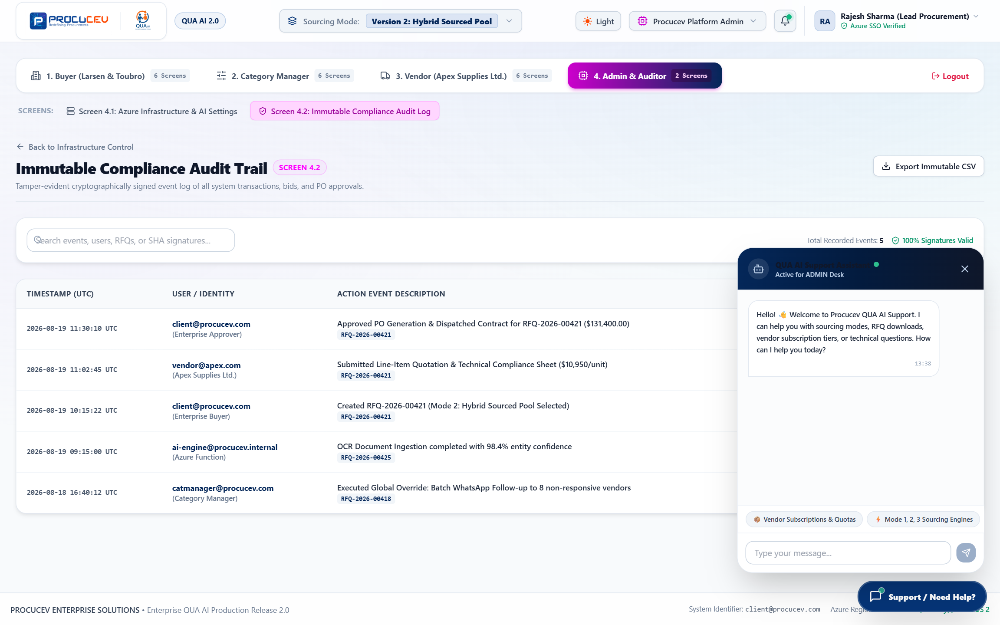
*Figure 9.2: Interactive AI Support Chat Widget.*

* **Context-Aware Assistant**: Instant assistance for procurement navigation, score explanations, and RFQ creation support.

---

## 10. Summary & File Manifest

| File / Artifact | Type | Description |
| :--- | :--- | :--- |
| [`Procucev_Enterprise_Platform_Documentation.docx`](./Procucev_Enterprise_Platform_Documentation.docx) | Microsoft Word (.docx) | Complete 17.3 MB master document with all 28 embedded high-res screenshots, tables, callouts, and system specifications. |
| [`SYSTEM_DOCUMENTATION.md`](./SYSTEM_DOCUMENTATION.md) | Markdown (.md) | Complete Markdown documentation file with live image links and Mermaid workflow diagrams. |
| `docs/screenshots/*.png` (28 Files) | High-DPI PNGs | Complete pixel-perfect screenshots of all 4 roles, 20+ screens, and critical enterprise modals. |
| `scratch/capture_all_screenshots.js` | Node.js Script | Puppeteer automation script to capture all screens. |
| `scratch/generate_doc_file.js` | Node.js Script | Docx generation script using `docx` package. |
